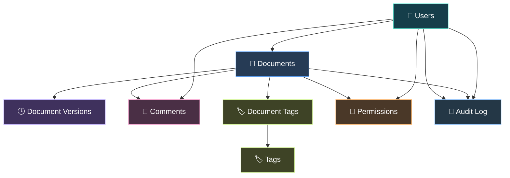
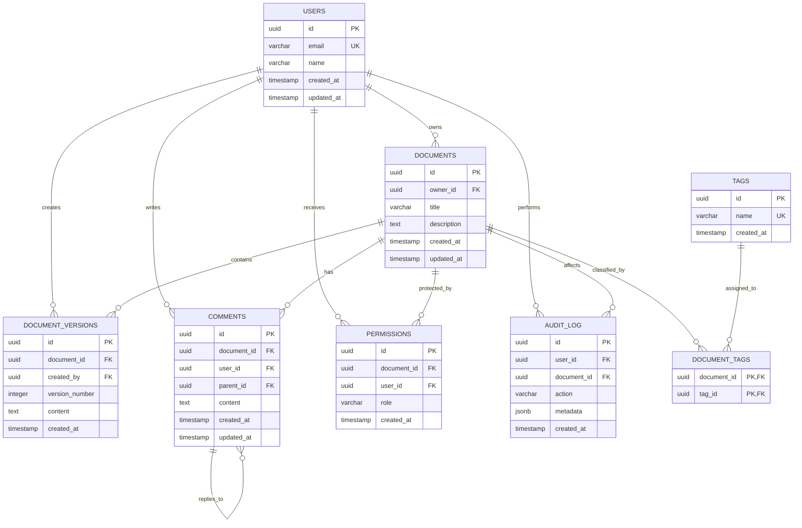
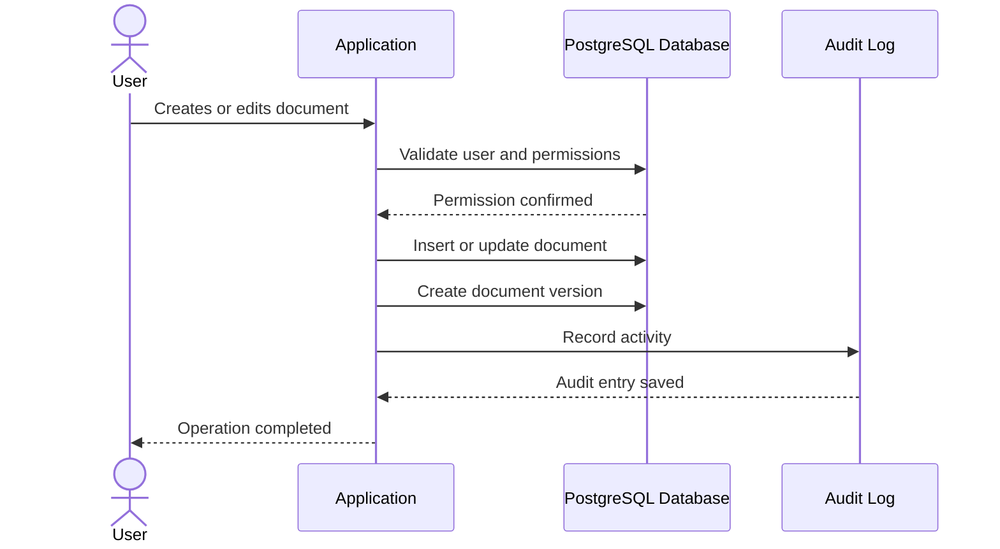

# 📚 Document Model

<p align="center">
  
  
  
  
</p>

<p align="center">
  <strong>A production-oriented PostgreSQL data model for a collaborative document management platform.</strong>
</p>

<p align="center">
  Designed around document versioning, threaded comments, role-based permissions, tagging, and auditability.
</p>

<p align="center">
  <a href="DATA_MODEL.md">📖 Read Data Model Documentation</a>
  •
  <a href="schema.sql">🗄️ View SQL Schema</a>
  •
  <a href="https://github.com/techtuber9988/document-model">💻 GitHub Repository</a>
</p>

---

## ✨ Overview

The **Document Model** project defines the relational database foundation for a collaborative document platform.

The model supports users creating and managing documents, maintaining immutable document versions, adding threaded comments, assigning tags, controlling access permissions, and tracking important activities through an audit log.

The primary goal is to create a schema that is:

- 🧩 **Modular**
- 🔐 **Secure**
- 📈 **Scalable**
- 🧱 **Consistent**
- 🕒 **Auditable**
- 🔄 **Version-aware**
- 🤝 **Collaboration-ready**

This project focuses on the **database architecture and data integrity layer**, rather than a complete frontend or backend application.

---

## 🎯 Project Goals

The database is designed to solve common challenges in collaborative document systems.

| Goal | Description |
|------|-------------|
| 📄 Document Management | Store and organize user-owned documents |
| 🕒 Version History | Preserve multiple versions of a document |
| 💬 Collaboration | Support threaded comments and discussions |
| 🏷️ Categorization | Organize documents using reusable tags |
| 🔐 Access Control | Define viewer, editor, and admin permissions |
| 🧾 Auditability | Track important system activities |
| 🛡️ Data Integrity | Enforce relationships and validation at database level |
| ⚡ Query Efficiency | Support common document and collaboration queries |

---

## 🧠 Core Features

<div align="center">

| Feature | Description |
|:---:|---|
| 📄 | Document creation and ownership |
| 🕒 | Immutable document version history |
| 👥 | User and collaborator management |
| 💬 | Threaded comments using self-referencing relationships |
| 🏷️ | Many-to-many document tagging |
| 🔑 | Granular permission management |
| 🧾 | Activity and audit tracking |
| ⏱️ | Automatic update timestamps |
| 🛡️ | Primary keys, foreign keys, checks, and unique constraints |

</div>

---

## 🏗️ System Architecture

The data model follows a relational architecture where each major responsibility is represented by a dedicated table.



### Architecture Explanation

- **Users** are the primary actors in the system.
- **Documents** represent the main content entities.
- **Document Versions** preserve historical changes.
- **Comments** allow discussions and threaded replies.
- **Tags** provide reusable categorization.
- **Document Tags** connect documents and tags.
- **Permissions** control access to documents.
- **Audit Log** records important user and document activities.

---

## 🗺️ Entity Relationship Diagram

The following diagram represents the main relationships between database entities.



---

## 🧱 Database Tables

### 1. 👤 `users`

Stores registered users who interact with the document platform.

| Column | Type | Description |
|--------|------|-------------|
| `id` | UUID | Unique user identifier |
| `email` | VARCHAR | Unique user email |
| `name` | VARCHAR | Display name |
| `created_at` | TIMESTAMP | Account creation time |
| `updated_at` | TIMESTAMP | Last profile update time |

**Important constraints:**

- Email must be unique.
- Each user receives a generated UUID.
- Creation and update timestamps are maintained.

---

### 2. 📄 `documents`

Stores the main document records.

| Column | Type | Description |
|--------|------|-------------|
| `id` | UUID | Unique document identifier |
| `owner_id` | UUID | References the document owner |
| `title` | VARCHAR | Document title |
| `description` | TEXT | Optional document description |
| `created_at` | TIMESTAMP | Document creation time |
| `updated_at` | TIMESTAMP | Last document update time |

**Relationship:**

```text
One User → Many Documents
```

A user can own multiple documents, while each document has one owner.

---

### 3. 🕒 `document_versions`

Stores the version history of every document.

| Column | Type | Description |
|--------|------|-------------|
| `id` | UUID | Unique version identifier |
| `document_id` | UUID | Related document |
| `created_by` | UUID | User who created the version |
| `version_number` | INTEGER | Sequential version number |
| `content` | TEXT | Snapshot of document content |
| `created_at` | TIMESTAMP | Version creation time |

### Why Versioning Matters

Instead of overwriting document content, each update can create a new version.

```text
Document
   │
   ├── Version 1
   ├── Version 2
   ├── Version 3
   └── Version 4
```

This allows the system to support:

- 🔄 Version history
- ⏪ Restore functionality
- 🔍 Historical comparison
- 🧾 Change tracking
- 🛡️ Data recovery

---

### 4. 🏷️ `tags`

Stores reusable tags that can be assigned to documents.

| Column | Type | Description |
|--------|------|-------------|
| `id` | UUID | Unique tag identifier |
| `name` | VARCHAR | Unique tag name |
| `created_at` | TIMESTAMP | Tag creation time |

Examples:

```text
engineering
research
meeting
personal
planning
documentation
```

---

### 5. 🔗 `document_tags`

Connects documents and tags through a many-to-many relationship.

| Column | Type | Description |
|--------|------|-------------|
| `document_id` | UUID | References a document |
| `tag_id` | UUID | References a tag |

### Relationship

```text
One Document → Many Tags
One Tag → Many Documents
```

The composite primary key prevents duplicate document-tag assignments.

---

### 6. 💬 `comments`

Stores comments and threaded replies.

| Column | Type | Description |
|--------|------|-------------|
| `id` | UUID | Unique comment identifier |
| `document_id` | UUID | Related document |
| `user_id` | UUID | Comment author |
| `parent_id` | UUID | Parent comment for threaded replies |
| `content` | TEXT | Comment content |
| `created_at` | TIMESTAMP | Comment creation time |
| `updated_at` | TIMESTAMP | Last comment update time |

### Threaded Comment Structure

```text
Comment A
   ├── Reply A1
   │     └── Reply A1.1
   └── Reply A2

Comment B
   └── Reply B1
```

The `parent_id` column references the `comments.id` column, allowing comments to reference other comments in the same table.

---

### 7. 🔐 `permissions`

Controls user access to individual documents.

| Column | Type | Description |
|--------|------|-------------|
| `id` | UUID | Unique permission identifier |
| `document_id` | UUID | Related document |
| `user_id` | UUID | User receiving permission |
| `role` | VARCHAR | Access role |
| `created_at` | TIMESTAMP | Permission creation time |

### Supported Roles

| Role | Access Concept |
|------|----------------|
| 👁️ `viewer` | Can view the document |
| ✏️ `editor` | Can modify the document |
| 🛡️ `admin` | Has administrative control |

The role field is restricted using a database-level check constraint.

---

### 8. 🧾 `audit_log`

Tracks important activities performed within the platform.

| Column | Type | Description |
|--------|------|-------------|
| `id` | UUID | Unique audit record |
| `user_id` | UUID | User performing the action |
| `document_id` | UUID | Related document |
| `action` | VARCHAR | Action name |
| `metadata` | JSONB | Additional event information |
| `created_at` | TIMESTAMP | Event timestamp |

### Example Actions

```text
document.created
document.updated
document.deleted
version.created
comment.created
permission.updated
tag.assigned
```

The `metadata` field allows flexible storage of additional information without changing the table structure.

---

## 🔗 Relationship Summary

| Relationship | Type | Explanation |
|--------------|------|-------------|
| Users → Documents | One-to-Many | One user can own multiple documents |
| Documents → Versions | One-to-Many | One document can have multiple versions |
| Users → Versions | One-to-Many | One user can create multiple versions |
| Documents → Comments | One-to-Many | A document can contain many comments |
| Users → Comments | One-to-Many | A user can write many comments |
| Comments → Comments | Self-Referencing | Comments can have nested replies |
| Documents ↔ Tags | Many-to-Many | Documents can use multiple tags |
| Documents ↔ Users | Many-to-Many | Permissions connect users and documents |
| Users → Audit Logs | One-to-Many | A user can perform many tracked actions |
| Documents → Audit Logs | One-to-Many | A document can have many related events |

---

## 🛡️ Data Integrity and Constraints

The schema uses PostgreSQL constraints to protect data quality.

### 🔑 Primary Keys

Every major table has a primary key.

```sql
id UUID PRIMARY KEY DEFAULT gen_random_uuid()
```

Primary keys ensure that each record is uniquely identifiable.

---

### 🔗 Foreign Keys

Foreign keys maintain relationships between tables.

```sql
owner_id UUID REFERENCES users(id)
```

They prevent records from referencing non-existent users, documents, or tags.

---

### 🚫 Unique Constraints

Unique constraints prevent duplicate values.

Examples:

```sql
email VARCHAR(255) UNIQUE
```

```sql
name VARCHAR(100) UNIQUE
```

```sql
UNIQUE(document_id, version_number)
```

---

### ✅ Check Constraints

Check constraints restrict invalid values.

Example:

```sql
CHECK (role IN ('viewer', 'editor', 'admin'))
```

This prevents unsupported permission roles from being inserted.

---

### 🧹 Automatic Timestamps

The schema includes an update timestamp trigger.

```sql
CREATE OR REPLACE FUNCTION trg_set_updated_at()
RETURNS TRIGGER AS $$
BEGIN
    NEW.updated_at = NOW();
    RETURN NEW;
END;
$$ LANGUAGE plpgsql;
```

This automatically updates the `updated_at` value when supported records are modified.

---

## 🔄 Data Flow



---

## 🧪 Example SQL Queries

### 📄 Get All Documents Owned by a User

```sql
SELECT
    d.id,
    d.title,
    d.description,
    d.created_at,
    d.updated_at
FROM documents d
WHERE d.owner_id = $1
ORDER BY d.updated_at DESC;
```

---

### 🕒 Get the Latest Version of a Document

```sql
SELECT
    dv.id,
    dv.document_id,
    dv.version_number,
    dv.content,
    dv.created_at
FROM document_versions dv
WHERE dv.document_id = $1
ORDER BY dv.version_number DESC
LIMIT 1;
```

---

### 🏷️ Find Documents by Tag

```sql
SELECT
    d.id,
    d.title,
    d.description
FROM documents d
JOIN document_tags dt
    ON d.id = dt.document_id
JOIN tags t
    ON t.id = dt.tag_id
WHERE t.name = $1
ORDER BY d.updated_at DESC;
```

---

### 💬 Get Comments with Author Details

```sql
SELECT
    c.id,
    c.content,
    c.parent_id,
    c.created_at,
    u.id AS user_id,
    u.name AS author_name
FROM comments c
JOIN users u
    ON u.id = c.user_id
WHERE c.document_id = $1
ORDER BY c.created_at ASC;
```

---

### 🔐 Get a User's Permissions

```sql
SELECT
    p.document_id,
    d.title,
    p.role,
    p.created_at
FROM permissions p
JOIN documents d
    ON d.id = p.document_id
WHERE p.user_id = $1
ORDER BY p.created_at DESC;
```

---

### 🧾 Get Document Activity

```sql
SELECT
    al.action,
    al.metadata,
    al.created_at,
    u.name AS performed_by
FROM audit_log al
JOIN users u
    ON u.id = al.user_id
WHERE al.document_id = $1
ORDER BY al.created_at DESC;
```

---

## 🚀 Getting Started

### Prerequisites

Make sure the following tools are installed:

- PostgreSQL 15 or later
- Git
- A PostgreSQL client such as `psql`, DBeaver, or pgAdmin

---

### 1. Clone the Repository

```bash
git clone https://github.com/techtuber9988/document-model.git
cd document-model
```

---

### 2. Create a Database

Open PostgreSQL and create a database:

```sql
CREATE DATABASE document_platform;
```

Connect to the database:

```sql
\c document_platform
```

---

### 3. Enable UUID Support

The schema uses UUID-based identifiers.

```sql
CREATE EXTENSION IF NOT EXISTS pgcrypto;
```

---

### 4. Execute the Schema

Run the SQL file:

```bash
psql -U postgres -d document_platform -f schema.sql
```

Or execute `schema.sql` using pgAdmin or DBeaver.

---

### 5. Verify the Tables

```sql
\dt
```

Expected tables include:

```text
users
documents
document_versions
tags
document_tags
comments
permissions
audit_log
```

---

## 📁 Project Structure

```text
document-model/
│
├── index.html          # Interactive documentation preview
├── style.css           # Documentation preview styling
├── schema.sql          # PostgreSQL database schema
├── DATA_MODEL.md       # Detailed data model documentation
└── README.md           # Project overview and setup guide
```

---

## 📊 Design Principles

### 🧱 Separation of Responsibilities

Each table represents one clear business responsibility.

For example:

- Documents store document metadata.
- Versions store historical content.
- Permissions store access rules.
- Audit logs store activity records.

This reduces duplication and improves maintainability.

---

### 🕒 Immutable Version History

Document versions are stored as separate records rather than replacing previous content.

This supports historical access and makes document changes traceable.

---

### 🔐 Database-Level Validation

Important rules are enforced directly in PostgreSQL using:

- Primary keys
- Foreign keys
- Unique constraints
- Check constraints
- Triggers

This prevents invalid data from entering the system even if application-level validation fails.

---

### 🤝 Flexible Collaboration

The combination of comments, permissions, tags, and audit logs creates a foundation for collaborative workflows.

---

### 📈 Scalability Considerations

For larger workloads, the following improvements may be considered:

- Indexing frequently queried columns
- Full-text search for document content
- Pagination for comments and audit logs
- Partitioning large audit tables
- Archiving older audit records
- Caching frequently accessed documents
- Optimizing version retrieval queries

---

## 🔮 Future Improvements

Potential future extensions include:

- [ ] Add document folders and nested collections
- [ ] Add soft deletion and recovery
- [ ] Add document sharing links
- [ ] Add organization or workspace support
- [ ] Add full-text search
- [ ] Add document locking
- [ ] Add collaborative editing support
- [ ] Add notification preferences
- [ ] Add database indexes for high-volume queries
- [ ] Add migration tooling
- [ ] Add seed data for testing
- [ ] Add automated schema tests
- [ ] Add API integration using Node.js or another backend

---

## 📚 Documentation

| Resource | Description |
|----------|-------------|
| 📖 [`DATA_MODEL.md`](DATA_MODEL.md) | Detailed explanation of entities, relationships, and design decisions |
| 🗄️ [`schema.sql`](schema.sql) | Complete PostgreSQL schema |
| 🌐 [`index.html`](index.html) | Interactive documentation webpage |
| 🎨 [`style.css`](style.css) | Styling for the documentation preview |

---

## 👨‍💻 Author

**Ayush Tripathi**

<p>
  <a href="https://github.com/techtuber9988">
    
  </a>
</p>

---

## ⭐ Support

If this project helped you understand relational database design, document versioning, or PostgreSQL schema architecture, consider giving the repository a star.

<p align="center">
  <strong>Designed with structure, integrity, and scalability in mind. 🚀</strong>
</p>
